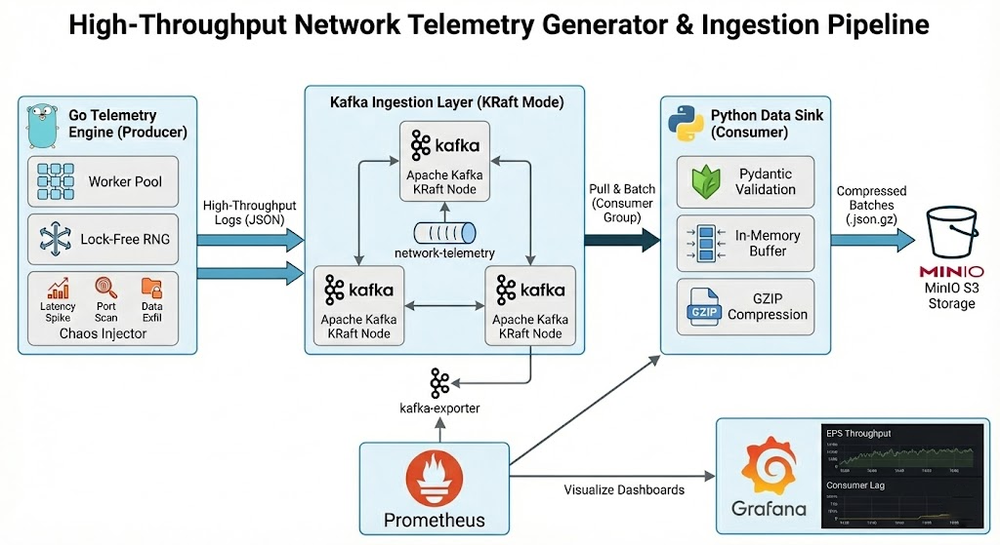

# Network Chaos Engine

## Executive Summary

I built this end-to-end data platform to solve a specific problem in distributed systems and observability: standard load generators produce perfectly clean, predictable data. But in the real world, systems are messy.

This project is a high-performance **Network Telemetry Generator, Ingestion Pipeline, and Real-Time Stateful Processor**. It is designed to simulate custom network traffic logs at a scale of 10,000+ events per second (EPS). More importantly, it acts as a "Chaos Engine"—purposefully injecting realistic network anomalies (latency spikes, dropped packets, data exfiltration) into the data stream.

Rather than just generating data, this platform proves out the entire lifecycle: high-throughput ingestion, compressed object storage for batch processing, and true-streaming stateful anomaly detection using Apache Flink to trigger deduplicated webhooks in real time.

---

## High-Level Architecture

The system is designed using a decoupled, event-driven microservice architecture to maximize throughput and scalability.



### 1. The Telemetry Engine (Go Producer)

A highly concurrent Go application that utilizes a worker pool pattern and lock-free randomization to generate synthetic JSON network logs. It saturates the network by batching messages asynchronously to Kafka using C-level bindings (`librdkafka`).

### 2. The Ingestion Layer (Apache Kafka KRaft)

A 3-node Apache Kafka cluster running in KRaft mode (Zookeeper-less). It acts as the shock absorber, decoupling the blazing-fast Go producer from the slower storage layer. It's configured with a replication factor of 3 for high availability.

### 3. The Data Sink (Python Consumer)

A resilient Python microservice that pulls messages from Kafka, strictly validates the schemas using `Pydantic`, and buffers the data. To prevent storage node crashes, it implements dual-trigger batching (by volume or time) and compresses the batches into `json.gz` files before writing to object storage.

### 4. The Real-Time Streaming (Flink)

A native Java 17 Flink application that performs stateful stream processing. Instead of micro-batching, it processes every event as it arrives, utilizing **Watermarks** to handle late-arriving packets and a **1-Minute Sliding Window** to calculate rolling bandwidth averages per IP address to detect active data exfiltration.

### 5. Storage & Observability (MinIO, Prometheus, Grafana)

- **MinIO:** Acts as a local, S3-compatible object storage sink for the compressed batch files.
- **Prometheus & Grafana:** Monitors the entire pipeline in real-time, scraping metrics via `kafka-exporter` to visualize pipeline throughput (EPS), consumer lag, and cluster health without adding overhead to the brokers.

### 6. Alert Deduplication (Redis, Webhook)

- To prevent "alert fatigue" during sustained network anomalies, the Flink job connects to an external Redis cache. When an anomaly triggers, it sets a 15-minute TTL lock in Redis before firing an asynchronous HTTP POST to a Discord/Slack webhook, ensuring on-call engineers are alerted once per incident, not 50 times a minute.

---

## Directory Structure

```text
├── docker-compose.yml        # The master orchestrator (Kafka, Flink, Redis, MinIO, Grafana)
├── producer/                 # Go Telemetry Engine Microservice
│   ├── cmd/telemetry/        # Application entrypoint
│   ├── internal/             # Config, Kafka producer wrapper, and Chaos generator
│   ├── go.mod
│   └── README.md             # Go-specific documentation
├── processor/                # Apache Flink Anomaly Detector (Java)
│   ├── pom.xml               # Maven dependencies and build config
│   ├── src/main/java/        # Stateful Sliding Window & Redis Sink logic
│   └── README.md             # Flink stream-processing documentation
├── consumer/                 # Python Data Sink Microservice
│   ├── requirements.txt
│   ├── src/                  # Pydantic models, batching logic, and MinIO client
│   └── README.md             # Batching & Storage documentation
├── monitoring/               # Prometheus configuration
│   └── prometheus.yml
└── grafana_dashboard/        # Pre-built dashboards for EPS and Consumer Lag monitoring
    └── kafka_dashboard.json
```

## The Chaos Modes (Defect Injection)

I designed the generator to simulate specific infrastructure and security failures. These can be toggled dynamically via environment variables:

The "Latency Spike": Simulates performance degradation (e.g., a database backup) by randomly spiking packet latency from a standard 10-50ms up to 2000ms+.

The "Port Scan": Simulates a security anomaly by dedicating a worker thread to rapidly attempt connections across 100+ sequential ports from a single source IP.

The "Data Exfiltration": Simulates data theft by generating massive outbound byte payloads (10MB+) compared to tiny inbound ACKs, routed over UDP port 53 (DNS Tunneling).

The "Connection Reset": Simulates reliability failures by injecting high volumes of TCP RST flags and HTTP 5xx errors.
